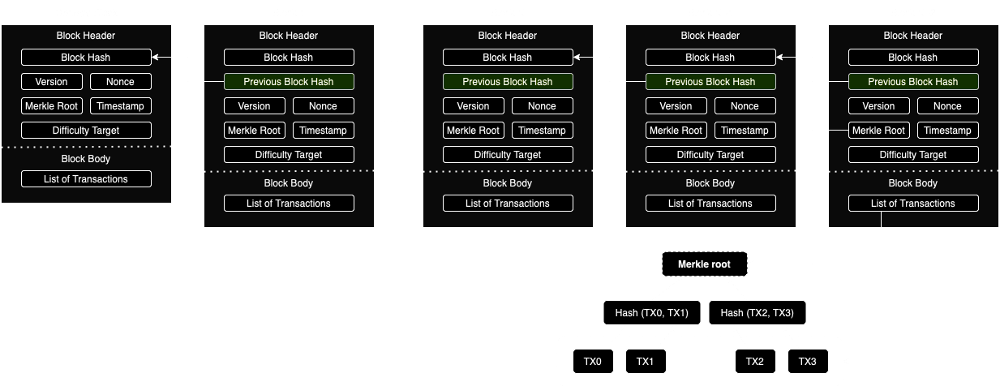
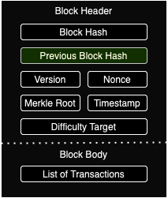

# 2. Fundamentals and Principles of Blockchains

## Structure of a Blockchain


## Block Structure


**Block Header**:
* Block Hash: hash of the block
* Previous Block Hash: hash of the previous block
* Version: version of the block
* Merkle Root: hash of the merkle tree/tree of transactions
* Timestamp: time of block creation
* Nonce: random number used in mining
* Difficulty Target: mining difficulty in PoW-based consensus

**Block Body**:
* Transactions: list of transactions within the block

## Transactions
Basic elements of a transaction:
* Sender's Address (public key)
* Receiver's Address (public key)
* Amount 
* Signature (transaction is signed by sender's private key)

Transaction lifecycle:
1. Transaction is created
2. Transaction is broadcasted to the network
3. Transaction is validated by nodes
4. Transaction is included in a block
5. Block is mined and added to the blockchain

## Example Transaction
```json
{
  "txid": "1eabcde1234567890abcdef1234567890abcdef1234567890abcdef1234567890",
  "version": 1,
  "locktime": 0,
  "vin": [
    {
      "txid": "abcdef1234567890abcdef1234567890abcdef1234567890abcdef1234567890",
      "vout": 0,
      "scriptSig": {
        "asm": "3045022100e3b0c44298fc1c149afbf4c8996fb92427ae41e4649b934ca495991b7852b855022100fb4b0a063b5f7f8a5c47b7e9e527e55e3e55ffb015e9078578b7d7c8f1fa3d4e",
        "hex": "483045022100e3b0c44298fc1c149afbf4c8996fb92427ae41e4649b934ca495991b7852b855022100fb4b0a063b5f7f8a5c47b7e9e527e55e3e55ffb015e9078578b7d7c8f1fa3d4e"
      },
      "sequence": 4294967295
    }
  ],
  "vout": [
    {
      "value": 0.50000000,
      "n": 0,
      "scriptPubKey": {
        "asm": "OP_DUP OP_HASH160 89abcdefabbaabbaabbaabbaabbaabbaabbaabbaabba OP_EQUALVERIFY OP_CHECKSIG",
        "hex": "76a91489abcdefabbaabbaabbaabbaabbaabbaabbaabba88ac",
        "reqSigs": 1,
        "type": "pubkeyhash",
        "addresses": [
          "1Ez69SnzzmePmZX3WpEzMKTrcBF2gpNQ55"
        ]
      }
    },
    {
      "value": 0.49900000,
      "n": 1,
      "scriptPubKey": {
        "asm": "OP_DUP OP_HASH160 89abcdefabbaabbaabbaabbaabbaabbaabbaabbaabba OP_EQUALVERIFY OP_CHECKSIG",
        "hex": "76a91489abcdefabbaabbaabbaabbaabbaabbaabbaabba88ac",
        "reqSigs": 1,
        "type": "pubkeyhash",
        "addresses": [
          "1A1zP1eP5QGefi2DMPTfTL5SLmv7DivfNa"
        ]
      }
    }
  ]
}
```
1. Alice wants to send 0.5 BTC to Bob. 
   * Inputs: Alice’s address, Bob’s address, amount (0.5 BTC), fee (0.001 BTC).
   * Outputs: Transaction outputs include the amount being sent to Bob and any change back to Alice.
   * Signature: Alice signs the transaction with her private key. 
2. Transaction Broadcast:
   * Alice’s transaction is broadcast to the Bitcoin network. 
3. Miners Validate:
   * Miners validate the transaction, checking Alice’s balance and the signature. 
4. Inclusion in a Block:
   * Once validated, the transaction is included in the next mined block.
5. Confirmation:
   * Bob sees the transaction after it’s included in a block and has been confirmed by the network.

## The role of nodes
Types of nodes:
* Full Nodes: store the entire blockchain, validate and relay transactions and blocks
* Light Nodes: store only block headers, rely on full nodes for transaction validation
* Mining Nodes: specialized full nodes that participate in the consensus mechanism

Node Functions:
* Maintaining Blockchain Copy: Every full node keeps a copy of the entire blockchain
* Validating Transactions: Ensure all transactions comply with network rules before adding them to a block
  * Double-spending: Ensure that the same funds are not spent twice
  * Transaction format: Check that the transaction is properly formatted
  * Transaction signature: Verify that the transaction is signed by the correct private key
  * Transaction validity: Ensure that the sender has enough funds to complete the transaction
  * Transaction history: Check that the transaction does not conflict with previous transactions
* Relaying Information: Propagate transactions and blocks throughout the network to ensure synchronization

## Consensus Mechanisms
* Ensure that all nodes agree on the state of the blockchain
* Prevent double-spending and other malicious activities
* Achieve agreement in a decentralized network

Types of Consensus Mechanisms:
* Proof of Work (PoW): Miners solve complex mathematical puzzles to validate transactions and create new blocks
* Proof of Stake (PoS): Validators are chosen based on the number of coins they hold
* Delegate Proof of Stake (DPoS): Validators are elected by coin holders to create new blocks
* Practical Byzantine Fault Tolerance (PBFT): Nodes reach consensus through a series of voting rounds

## Proof of Work (PoW)


# References
{cite}`sybilmubashar:article`
{cite}`bitcoin:article`