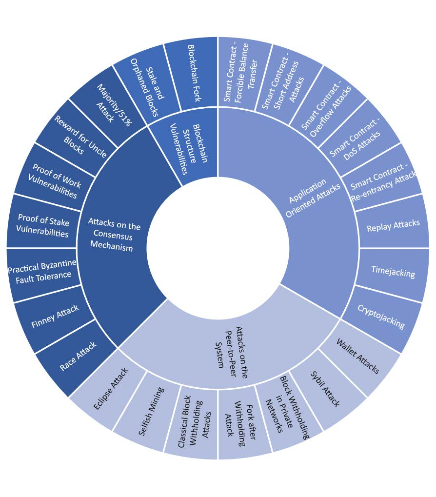

# 4. Attack Vectors on Blockchains

## Introduction
* "Blockchain technology can solve all our future problems while ensuring security and privacy"
  * Well, no
* Blockchains are not immune to attacks (like any IT system)
  * Various attack vectors exist
  * Understanding these vectors is crucial for developers and users
  * Blockchain "hype" led to a false sense of security
  * According to SlowMist, there were a total of 464 security incidents in 2023, with losses amounting to $2.486 billion {cite}`mediumAnalysisSlowMist:online` 
    * over 1.7 Billion USD stolen alone in crypto thefts alone 
    * https://hacked.slowmist.io/en/

## Overview

{cite}`konig2020risks`

## Types of Attacks
* **Blockchain Structure Vulnerabilities**
  * one of the most fundamental risks of blockchain technology
  * Primarily target integrity, security and availability of the blockchain foundation
  * Attacks exploit flaws in the fundamental design and implementation of the blockchain
    * protocols, data structures, transaction processing and recording
  * byproduct of the technology
  * **Examples**:
    * Blockchain Forks (Soft and Hard Forks, sometimes intentional (DAO Hack revert), sometimes accidental)
    * Stale and Orphaned Blocks

* **Consensus Mechanism Vulnerabilities**
  * Attacks exploit flaws in the consensus mechanism of the blockchain
  * target the agreement among participants on the validity of transactions
  * **Examples**:
    * 51% Attack
    * Selfish Mining
    * Nothing at Stake Attack
    * Finney Attack
  
* **Application Oriented Attacks**
  * Attacks exploit vulnerabilities in the applications built on top of the blockchain
    * smart contracts, decentralized applications, wallets, etc.
  * they exploit the application's logic and not the blockchain itself
  * outcome heavily depends on the application's design and implementation
  * **Examples**:
    * Timejacking
    * Replay Attacks
    * Attacks on Smart Contracts and DApps (Overflow attacks, (D)Dos attacks, etc.)

* **Attacks on P2P Network**
  * Attacks exploit vulnerabilities in the peer-to-peer network (the backbone of blockchain technology)
  * network attacks nothing new, however distributed nature of blockchain networks makes them more complex
  * attacks aim to disrupt communication, isolate node or manipulate transmissions
  * **Examples**:
    * Eclipse Attack
    * Block Withholding Attack
    * Sybil Attack

